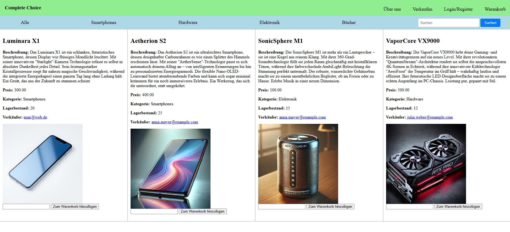

# Complete Choice

Complete Choice ist ein Online-Shop-Projekt, das eine Vielzahl von Funktionen bietet, um Eure Produkte übersichtlich zu präsentieren, zu filtern und direkt zu kaufen. 

## Funktionen

- **Übersicht über alle Artikel**  
  Die Startseite ([Index.php](Index.php)) listet alle verfügbaren Produkte mit Bildern, Beschreibungen, Preisen und weiteren Details auf.
  

- **Produktvorschau**  
  Mithilfe der Vorschaufunktion (über [js/insertPreview.js](js/insertPreview.js)) könnt Ihr eine Live-Vorschau Eures Artikels sehen, bevor Ihr ihn zum Verkauf freigebt.
  

- **Filtern nach Kategorie**  
  Nutzt die Navigation ([parts/nav/CatNav.php](parts/nav/CatNav.php)), um Produkte nach Kategorien wie z.B. nur Smartphones, Hardware, Elektronik und Bücher anzuzeigen.
  

- **Filtern nach Verkäufer**  
  Über die Filterfunktion auf der Seite [Verkaufer.php](Verkaufer.php) könnt Ihr Produkte eines bestimmten Verkäufers anzeigen lassen.
  

- **Warenkorb**  
  Produkte können über den Warenkorb ([Cart.php](Cart.php)) gesammelt, Mengen angepasst und später bestellt werden.
  

- **Suchmöglichkeit**  
  Die Live-Suche wird durch [js/autocomplete.js](js/autocomplete.js) unterstützt und basiert auf der Abfrage in [searchGetJson.php](searchGetJson.php). Dies erlaubt es, gezielt nach Produkten zu suchen.
  
  
  

## Installation und Setup

1. **Datenbank erstellen:**  
   Importiert das SQL-Skript (z.B. aus `sql/Complete Choice Create.sql`) in Eure MySQL-Datenbank.
   
2. **Server konfigurieren:**  
   Legt das Projekt in Eurem Webserver-Verzeichnis ab. Stellt sicher, dass PHP (mindestens Version 7.1) installiert und die benötigten Erweiterungen, wie die GD-Bibliothek, aktiviert sind.

3. **Projekt starten:**  
   Ruft über den Browser die [Index.php](Index.php)-Seite auf, um den Online-Shop zu nutzen.

## Hinweise

- Alle CSS- und JavaScript-Dateien befinden sich in den Ordnern `css/` und `js/`.
- Session-Management und Benutzerverwaltung sind in Dateien wie [Login.php](Login.php), [Register.php](Register.php) und [Logout.php](Logout.php) umgesetzt.
- Die Navigation wird über die Dateien in `parts/nav/` realisiert, welche für ein einheitliches Benutzererlebnis sorgen.
- Weiterführende Funktionen wie die Produktvorschau und die Suchmöglichkeit sorgen für eine interaktive und benutzerfreundliche Oberfläche.

Viel Spaß und Erfolg mit Complete Choice!